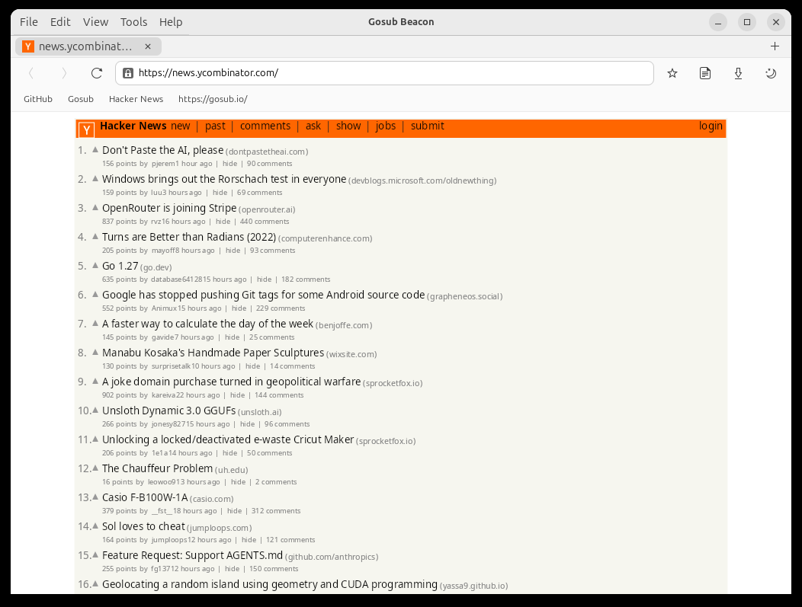
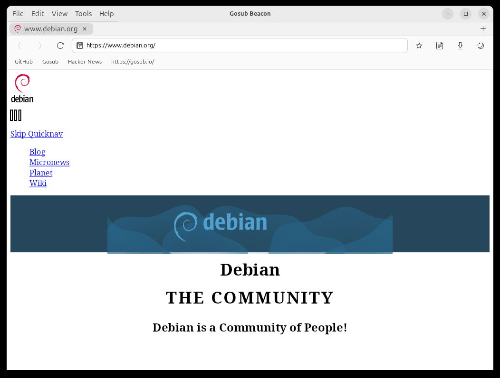
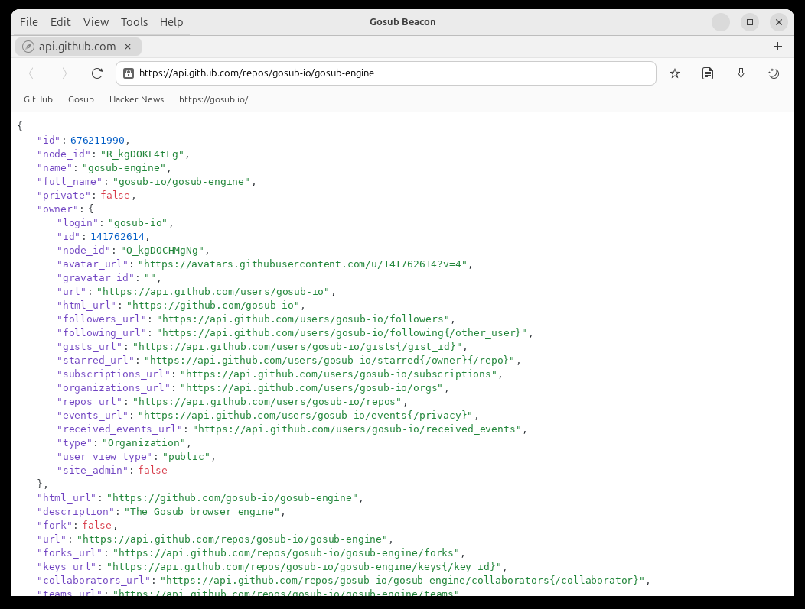
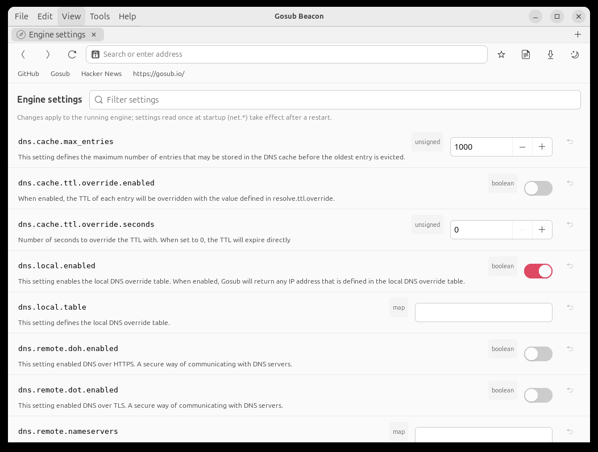
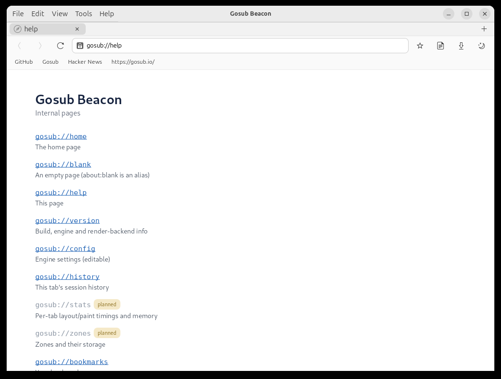
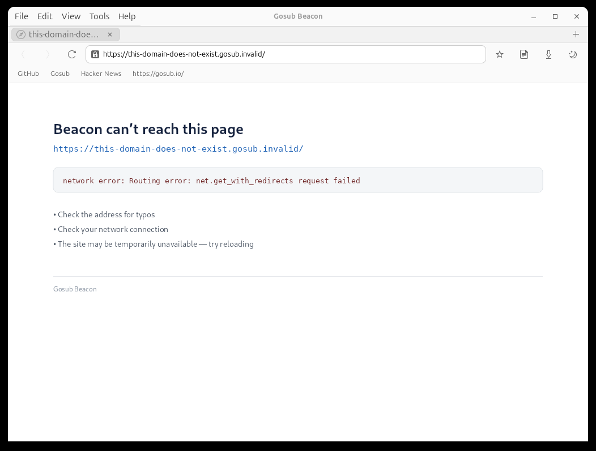
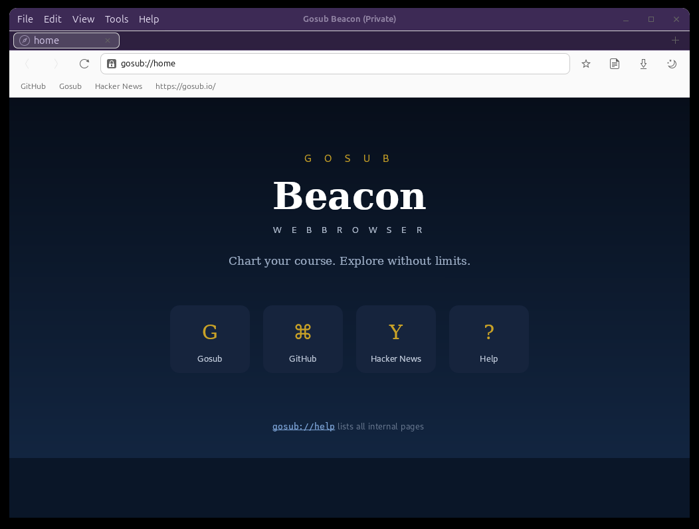
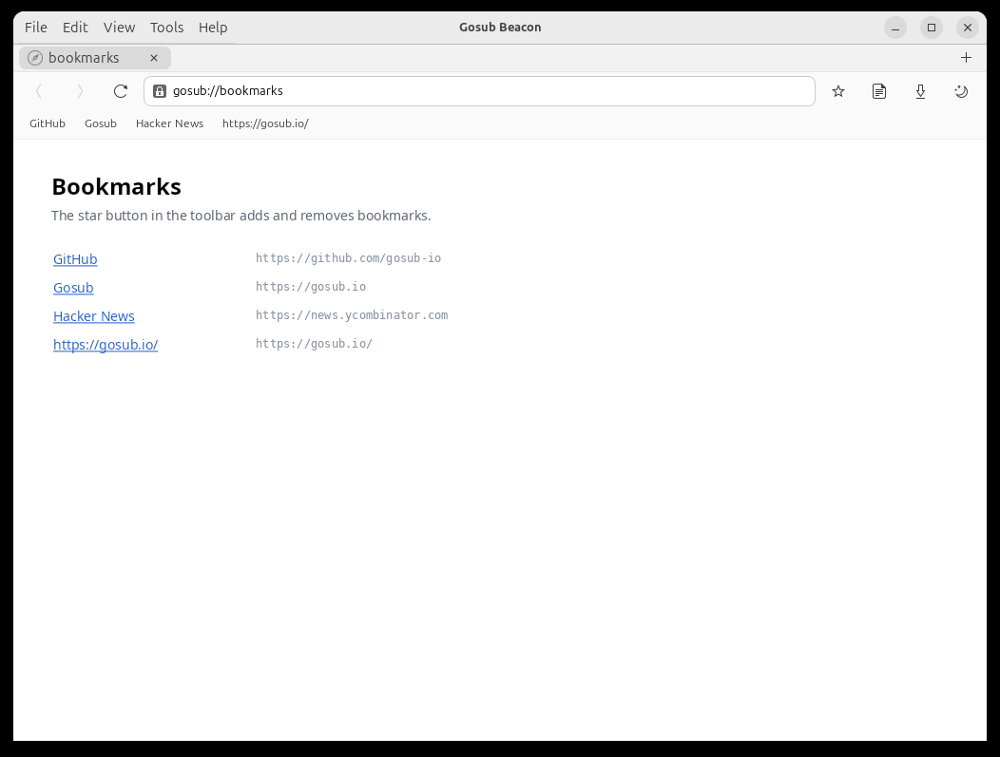

# Gosub Beacon — GTK browser

Beacon is a GTK4 browser built on the [Gosub engine](https://github.com/gosub-io/gosub-engine).
The engine does the actual work (networking, cookies, storage, history, rendering); Beacon
is the native chrome around it. It exists to test the engine in a real application, so
don't expect a daily driver — but basic browsing works.


Currently working:

- page loading and rendering (Skia rasterization, GPU compositing via GtkGLArea)
- tabs, back/forward with a tree-shaped session history
- session restore: the previous session's tabs reopen on start; Ctrl+Shift+T
  reopens a closed tab
- bookmarks and visited history in sqlite, with a bookmarks bar and URL-bar completion
- downloads with a save dialog and a progress popover
- keyboard: Tab focus traversal, Enter on links, scrolling keys
- right-click context menu (open/copy link, image, save link as)
- internal pages: gosub://home, help, version, history, bookmarks and a settings
  editor on gosub://config
- favicons, cursor shapes, error pages, a JSON viewer
- view-source: with syntax highlighting and line numbers, in a tab
- file:// URLs: local pages load their own subresources, directories get an index
  page, and a filesystem path typed in the address bar just works
- private windows (Ctrl+Shift+P): in-memory cookies and storage, no history recorded
- page zoom (Ctrl+±/0, Ctrl+wheel)
- crashed tabs show a reload page instead of taking the browser down

Not working yet: JavaScript, forms and text input, text selection.

## More screenshots

| | |
|---|---|
|  |  |
|  |  |
|  |  |
|  |  |

[All screenshots](./docs/screenshots/)

## Building

Beacon uses path dependencies into the engine, so check out
[gosub-engine](https://github.com/gosub-io/gosub-engine) next to this repository
(`../gosub-engine`), on the `beacon` branch (upstream main plus engine work Beacon
needs that has not merged yet).

Dependencies on Debian/Ubuntu, or similar on other systems:

```bash
sudo apt install libgtk-4-dev libglib2.0-dev libcairo2-dev libgdk-pixbuf-2.0-dev \
                 libpango1.0-dev libsqlite3-dev libssl-dev pkg-config \
                 clang libclang-dev libgl-dev libegl-dev libfontconfig-dev libfreetype-dev
```

Linux only for now. macOS and Windows shells will consume the engine's C API instead of
this GTK code, but help with either is welcome.

## Running

```bash
cargo run                          # opens the default startup tabs
cargo run -- https://example.com   # URLs on the command line become the startup tabs
```

Profile data (cookies, local storage, bookmarks/history, settings) ends up in
`~/.local/share/gosub-beacon`.

### Running in a container

To (re-)create a docker/podman image, you can use the supplied [Dockerfile](./Dockerfile) to build a local image with dependencies installed.

#### Building a image

First build the image.

```shell
# docker
docker build --tag gosub-beacon .
# podman
podman build --tag gosub-beacon .
```

#### Running the image

Run this image using Wayland (X11 should also work)

```shell
# docker
docker run --rm -it \
       --user="$(id -u):$(id -g)" \
       --workdir=/tmp \
       \
       -e WAYLAND_DISPLAY="$WAYLAND_DISPLAY" \
       -e DISPLAY="$DISPLAY" \
       \
       -e XDG_RUNTIME_DIR=/tmp/runtime \
       -v tmpfs:/tmp/runtime \
       -v /tmp/.X11-unix:/tmp/.X11-unix:ro \
       -v "$XDG_RUNTIME_DIR"/"$WAYLAND_DISPLAY":/tmp/runtime/"$WAYLAND_DISPLAY":ro \
       \
       gosub-beacon

# podman
podman run --rm -it \
       --userns=keep-id \
       --workdir=/tmp \
       \
       -e WAYLAND_DISPLAY="$WAYLAND_DISPLAY" \
       -e DISPLAY="$DISPLAY" \
       \
       -e XDG_RUNTIME_DIR=/tmp/runtime \
       -v tmpfs:/tmp/runtime \
       -v /tmp/.X11-unix:/tmp/.X11-unix:ro \
       -v "$XDG_RUNTIME_DIR"/"$WAYLAND_DISPLAY":/tmp/runtime/"$WAYLAND_DISPLAY":ro \
       \
       gosub-beacon

```

