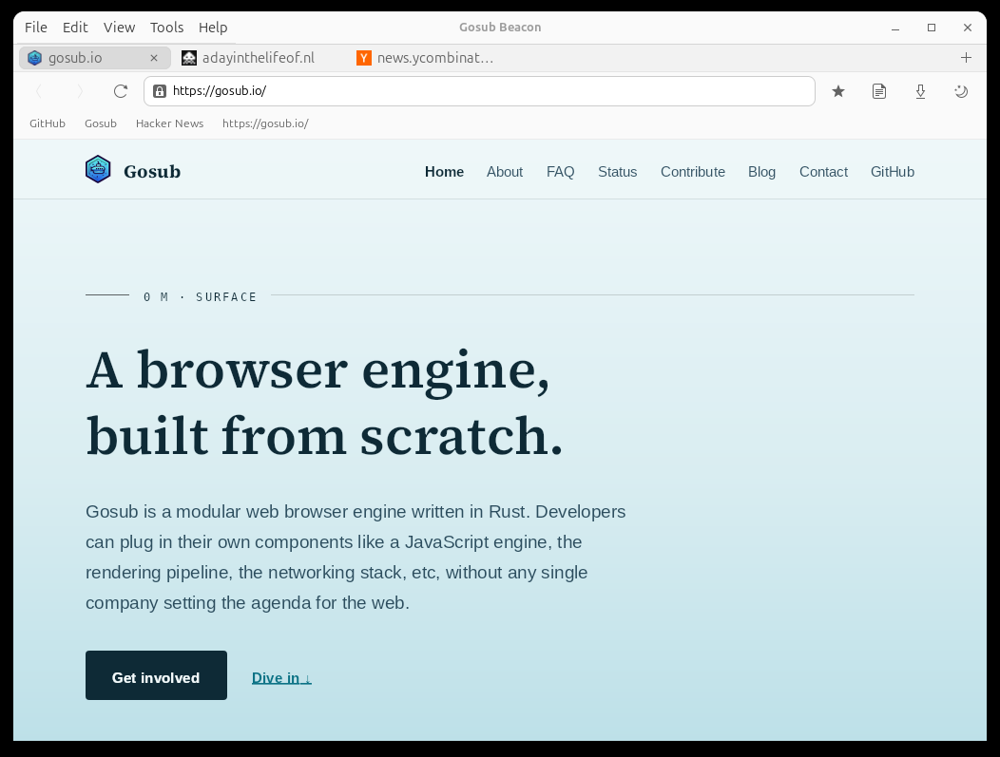

# Gosub Beacon

Beacon is a browser built on the [Gosub engine](https://github.com/gosub-io/gosub-engine).
The engine does the actual work (networking, cookies, storage, history, rendering); Beacon
is the native chrome around it: a GTK4 shell on Linux and a Swift/AppKit shell on macOS,
both over the same Rust core. It exists to test the engine in a real application, so
don't expect a daily driver — but basic browsing works.



More in [docs/screenshots](./docs/screenshots/).

## Platforms

- **Linux**: the GTK shell, the most complete one. It is also packaged as a Flatpak,
  which brings its own GTK and so runs on distributions whose GTK is too old; see
  [packaging/flatpak](./packaging/flatpak/README.md). A second, minimal frontend in egui
  (Vello on wgpu, no GTK or Skia) does tabs, navigation and rendering and little else.
- **macOS**: a native Swift/AppKit shell in [swift/](./swift/README.md), over the C ABI in
  `crates/beacon-ffi`. Signed and notarized DMGs are published at
  [gosub.io/build](https://gosub.io/build).
- **Windows**: on hold. A C#/WPF shell over the same C ABI exists on the unmerged
  `windows` branch, but it is not being worked on, is behind `main` and is not built in CI.

## Getting the source

Beacon uses path dependencies into the engine, so check out
[gosub-engine](https://github.com/gosub-io/gosub-engine) next to this repository
(`../gosub-engine`), on the `beacon` branch (upstream main plus engine work Beacon
needs that has not merged yet):

```bash
git clone https://github.com/gosub-io/gosub-beacon.git
git clone -b beacon https://github.com/gosub-io/gosub-engine.git
cd gosub-beacon
```

You need Rust from [rustup](https://rustup.rs); `rust-toolchain.toml` selects stable. The
first build compiles the engine and takes a few minutes.

## Building and running on Linux

Dependencies on Debian/Ubuntu, or similar on other systems:

```bash
sudo apt install libgtk-4-dev libglib2.0-dev libcairo2-dev libgdk-pixbuf-2.0-dev \
                 libpango1.0-dev libsqlite3-dev libssl-dev pkg-config \
                 clang libclang-dev libgl-dev libegl-dev libfontconfig-dev libfreetype-dev
```

These are for the GTK frontend. The egui one needs none of them:

```bash
cargo build                                          # both binaries
cargo build --no-default-features --features egui   # just the egui one
```

```bash
cargo run --bin gosub-beacon-gtk                          # opens the default startup tabs
cargo run --bin gosub-beacon-gtk -- https://example.com   # URLs become the startup tabs
cargo run --bin gosub-beacon-egui -- https://example.com  # the other frontend
```

## Building and running on macOS

Skip the Linux commands: a bare `cargo build` (or `make build`) builds the GTK shell, which
does not compile on a Mac; it stops with these directions instead. The Mac app is the Rust C ABI (`beacon-ffi`) plus a Swift package. Besides Rust
you need the Xcode Command Line Tools (`xcode-select --install`), which bring Swift and git.
From the `gosub-beacon` checkout:

```bash
cargo build -p beacon-ffi                  # the Rust side
cd swift
swift run BeaconMac https://example.com    # builds and starts the Swift app
```

Run it from a session on the Mac's own screen: started over ssh, the window has nowhere to
draw and stays blank. `swift/package.sh` turns the build into a universal (arm64 and
x86_64) `.app` and DMG; that, and everything else about the Mac shell, is in
[swift/README.md](./swift/README.md).

## Development

`make test` runs the unit tests, clippy and the format check; `make fix-format` applies
`cargo fmt` and clippy's fixes. CI runs the same on Ubuntu, builds and tests the isolation
build under Xvfb (`scripts/isolation-smoke.sh`; see [docs/isolation.md](docs/isolation.md)),
and on `macos-14` builds the egui frontend, the C ABI with a headless C consumer, and the
Swift app.

## Running in a container

To (re-)create a docker/podman image, you can use the supplied [Dockerfile](./Dockerfile) to build a local image with dependencies installed.

### Building an image

First build the image.

```shell
# docker
docker build --tag gosub-beacon .
# podman
podman build --tag gosub-beacon .
```

Use args to use specific branches and/or forks for the engine.

- `ENGINE_REMOTE`
- `ENGINE_BRANCH`

```shell
# docker
docker build --tag gosub-beacon --build-arg='ENGINE_BRANCH=main' .

# podman 
podman build --tag gosub-beacon --build-arg='ENGINE_BRANCH=main' .
```

### Running the image

Run this image using Wayland (X11 should also work)

```shell
# docker
docker run --rm -it \
       --user="$(id -u):$(id -g)" \
       --workdir=/tmp \
       \
       -e WAYLAND_DISPLAY="$WAYLAND_DISPLAY" \
       -e DISPLAY="$DISPLAY" \
       \
       -e XDG_RUNTIME_DIR=/tmp/runtime \
       -v tmpfs:/tmp/runtime \
       -v /tmp/.X11-unix:/tmp/.X11-unix:ro \
       -v "$XDG_RUNTIME_DIR"/"$WAYLAND_DISPLAY":/tmp/runtime/"$WAYLAND_DISPLAY":ro \
       \
       gosub-beacon

# podman
podman run --rm -it \
       --userns=keep-id \
       --workdir=/tmp \
       \
       -e WAYLAND_DISPLAY="$WAYLAND_DISPLAY" \
       -e DISPLAY="$DISPLAY" \
       \
       -e XDG_RUNTIME_DIR=/tmp/runtime \
       -v tmpfs:/tmp/runtime \
       -v /tmp/.X11-unix:/tmp/.X11-unix:ro \
       -v "$XDG_RUNTIME_DIR"/"$WAYLAND_DISPLAY":/tmp/runtime/"$WAYLAND_DISPLAY":ro \
       \
       gosub-beacon

```

